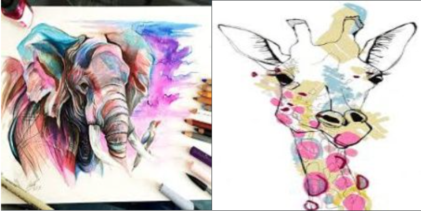
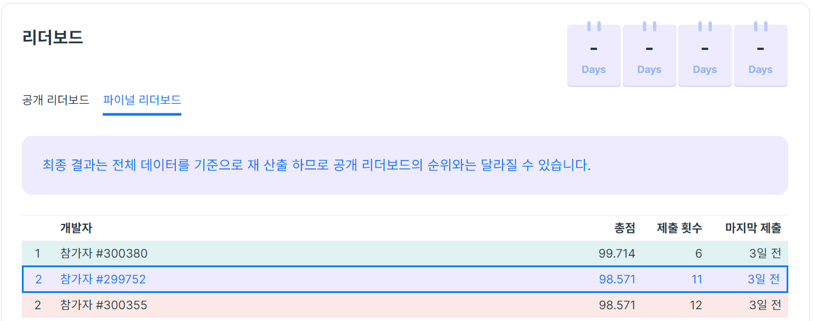

# Programmers 2021 Dev-Matching : 
머신러닝 개발자 (상반기)

# ***Paint Image Classification***

---



## *Dataset Overview*

---

## ***Paint Dataset***

- 7 ***Class***

    ***`Dog` `Elephant` `Giraffe`*** 

    ***`Guitar` `Horse` `House` `Person`***

- ***Image size : 227 $\times$ 227***
- ***Number of Train Images : 3500***
- ***Number of Test Images : 350***
- ***Evaluation Metric : Accuracy***

## *Summary*

---

### `**Name : 참가자 #299752**`

`**Rank : 2**`

`**Final Score : 98.571**`

`**Entries : 11**`

### `**Task**`

`**Paint image classification**`

### `**Notebook**`

[submission.ipynb](./submission.ipynb)

[submission.html](./submission.html)

---



---

## *Solution*

---

### *Exploratory Data Analysis*


Class 분포

```python
####### Caculate mean and std #######

# pixel count
count = len(train_df) * 227 * 227

# mean and std
total_mean = psum / count
total_var  = (psum_sq / count) - (total_mean ** 2)
total_std  = torch.sqrt(total_var)

# output
print('mean: '  + str(total_mean))
print('std:  '  + str(total_std))

# mean: tensor([0.4569, 0.5074, 0.5557])
# std:  tensor([0.2888, 0.2743, 0.2829])
```

---

### *Augmentation*

- **HorizontalFlip()**

    → **Test Time Augmentation을 염두해두고 선택**

- **ToGray()**

    **→ 그림 이미지라서 색조가 너무 다양해서 색이 아닌 전체적인 object의 모양을 보고 feature를 잡기를 원해서 선택**

- **Blur()**

    → **그림 이미지 특성상 blurring된 것 같은 효과가 많아 선택**

- **CutMix**

    → **대회 특성 상 Public score 채점 비율이 낮고, 문제가 쉬워 Generalized Performance를 올리기 위해 사용**

    → **Swin Transformer에서만 사용**

---

### ***Model***

- **NFNet**
    - **kaggle Ailen Signal Search 대회에 참가 중인데 discussion에서 NFNet과 EfficientNet이 대체로 성능이 좋았다라는 글을 보았고, 실제로도 성능이 좋았다.**
    - **EfficientNet은 Public score 성능이 좋지 않았음**
    - **Public score**
        - **NFNet : `100.0`**
        - **EfficientNet-b0 : `90.0`**

    ```yaml
    base:
      seed: 77
      model_arc: 'nfnet_l0'
      num_classes: 7
      input_dir: './train/train.csv'
      output_dir: './results/'
      train_only: False
      image_size: 227
      cutmix_args:
        use_cutmix: False
        beta: 1.0
        cutmix_prob: 0.5
      train_args:
        num_epochs: 6
        train_batch_size: 32
        val_batch_size: 32
        max_lr: 0.0001
        min_lr: 0.00001
        cycle: 3
        gamma: 0.5
        weight_decay: 0.000001
        log_intervals: 10
        eval_metric: 'accuracy'    
        n_splits: 5
    ```

- **Swin-Transformer**
    - **Naver boostcamp AI Tech Object Detection 경진대회에서 사용했을 때 매우 좋은 결과를 보여줬다.**
    - **모델을 앙상블 할 때 구조가 다른 모델들끼리 시도했을 때 좋은 결과가 있을 확률이 높아서 선택**
    - **Public score는 낮지만, 모든 Fold의 Validation Accuracy가 높았다.**

        → **좋은 Generalized Performance를 보여줄 것이라 예상했다.**

    - **Public score**
        - **Swin-Transformer base : `97.14`**

    ```yaml
    swin:
      seed: 777
      model_arc: 'swin_base_patch4_window7_224'
      num_classes: 7
      input_dir: './train/train.csv'
      output_dir: './results/'
      train_only: False
      image_size: 224
      cutmix_args:
        use_cutmix: True
        beta: 1.0
        cutmix_prob: 0.5
      train_args:
        num_epochs: 10
        train_batch_size: 16
        val_batch_size: 16
        max_lr: 0.0001
        min_lr: 0.00001
        cycle: 3
        gamma: 0.5
        weight_decay: 0.000001
        log_intervals: 10
        eval_metric: 'accuracy'    
        n_splits: 5
    ```

---

### ***Training***

- **5-Fold Cross Validation**
    - **데이터셋이 작을 때 많이 쓰이는 검증 전략**
    - **단일 모델 학습보다 효과가 좋았음**
    - **경진대회에서 보편적으로 쓰이는 방법**

- **CosineAnnealingWarmUpRestarts scheduler**
    - **LR 분석하기가 매우 좋다.**

        → **LR이 높아질 때 validation score가 떨어지는 지점을 파악하고 조절하기 쉽다.**

    - **Local Optima에서 잘 빠져나간다.**


---

### ***Technique***

- **Test Time Augmentation (TTA)**
    - **Horizontal Flip**

- **Stacking Ensemble**
    - **soft voting을 사용하여 NFNet과 Swin-Transformer를 Ensemble하였다.**
    - **Swin-Transformer의 Public accuracy가 97.14에서 앙상블 이후 100.0이 된 것을 확인한 후 효과가 있을 거라고 생각했다.**

        → **Validation accuracy의 경우 Swin-Transformer가 NFNet보다 훨씬 좋았기 때문**

---

***Conclusion*

문제가 쉬워 대회 변별력이 그렇게 크지 않았던 것 같다. 

첫 제출에서 NFNet이 Public score가 100.0이 나와 Validation score에 의존할 수 밖에 없었던 
새로운 경험이었다.

Generalized Performance를 올려주는 기법 중 하나인 MultiSample Dropout을 적용해보고 있었지만 
시간이 부족해 시도해보지 못한 점이 아쉬웠다.

CutMix가 Robust한 모델을 만드는 데 크게 작용하지 않았나 싶다.

구조가 다른 모델끼리 앙상블하는 기법은 지금까지 경험상으로는 항상 좋은 퍼포먼스를 보여줬던 것 같다.

Naver boostcamp AI Tech에 참가하는 사람들끼리 solution을 발표하는 시간을 가졌는데 피드백을 주고받는 과정에서 다양한 인사이트를 얻을 수 있어 유익한 시간이었다.**

****
